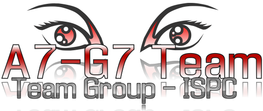

--------
# Aula 7 Grupo 7- TEAM GROUP 
## Indice-Navegacion
1. [Informacion General](#informacion-general)
2. [Tecnologias](#tecnologias)
3. [Equipo](#equipo)
4. [FAQs](#faqs)
### Informacion General
***
Equipo proyecto integrador del Instituto Superior Politecnico Cordoba 

## Tecnologias
***
Tecnoligas que se abordan en este proyecto:
* : Ultima Version
* : Ultima Version
* : Ultima Version

## Equipo
***
### *Gaspar Guzman
### *Christian Linares Crivello
### *Boris Lejonagoitia
### *Roxana Ledesma
### *Gustavo Herrera
### *Ingrid Kaufman
### *Lescano Marcos

## FAQs
***
A list of frequently asked questions
1. **This is a question in bold**
Answer of the first question with _italic words_. 
2. __Second question in bold__ 
To answer this question we use an unordered list:
* First point
* Second Point
* Third point
3. **Third question in bold**
Answer of the third question with *italic words*.
4. **Fourth question in bold**
| Headline 1 in the tablehead | Headline 2 in the tablehead | Headline 3 in the tablehead |
|:--------------|:-------------:|--------------:|
| text-align left | text-align center | text-align right |
